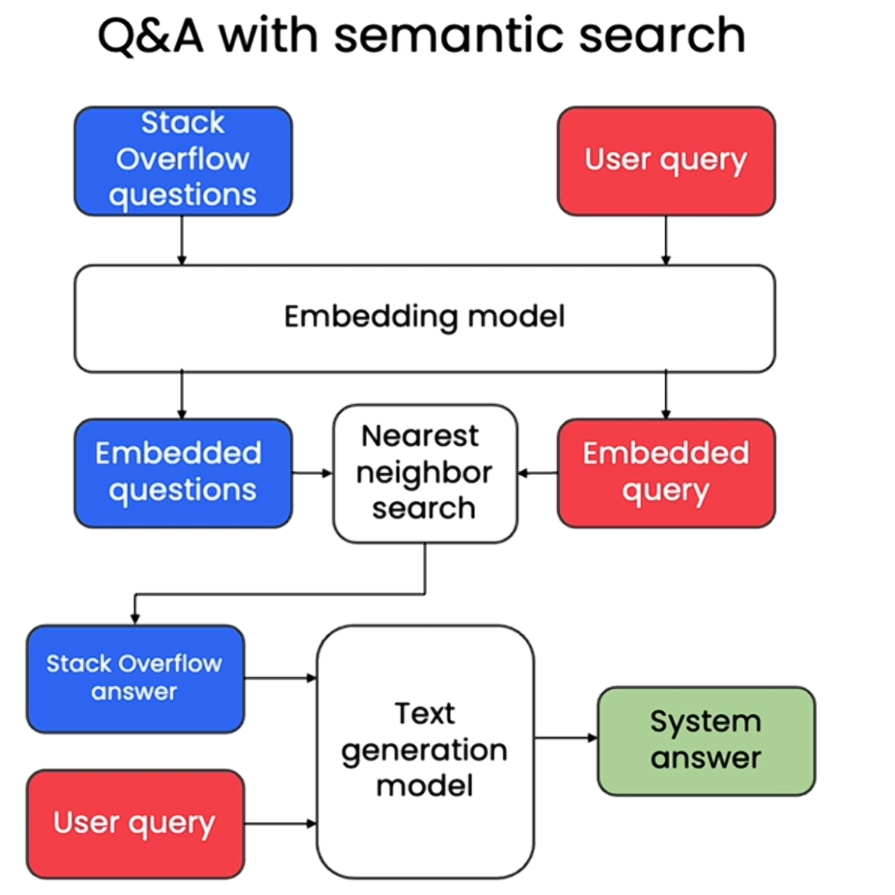

# Semantic Q&A System with Vertex AI

A question-answering system that uses **semantic search** and **LLMs** to find and generate answers from a Stack Overflow dataset.

! 

## Features
- 🔍 **Semantic Search**: Finds relevant answers using embeddings (Google's `textembedding-gecko`).
- 💬 **LLM-Powered Answers**: Generates natural responses using Vertex AI's `text-bison`.
- ⚡ **Optimized Search**: Uses **ScaNN** for fast approximate nearest-neighbor lookup.
- 🛠️ **Handles Unknown Queries**: Gracefully responds when no match is found.

## Tech Stack
- **Google Vertex AI** (Embeddings & Text Generation)
- **Python** (Pandas, NumPy, Scikit-learn)
- **ScaNN** (Scalable Nearest Neighbors)
- **Jupyter Notebook** (Prototyping)

